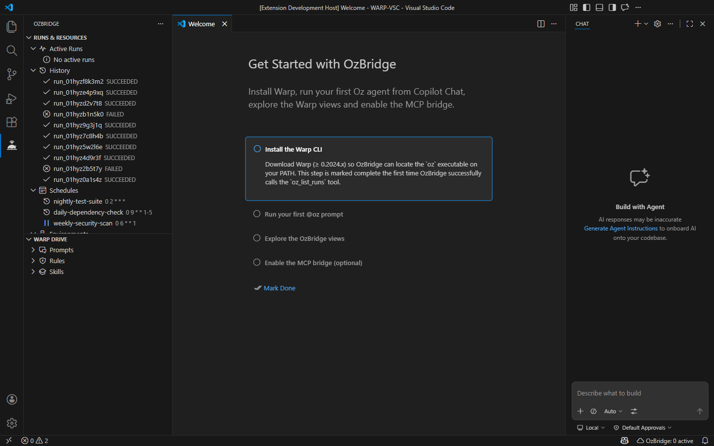

# Warp Bridge for VS Code

[](https://github.com/sena-labs/warp-vsc-bridge/actions/workflows/ci.yml)
[](https://code.visualstudio.com/)
[](LICENSE)

Run **Warp Oz agents** directly from VS Code Copilot Chat — either via the
`@warp` **Chat Participant** or through **Agent-Native Language Model Tools**
that Copilot Agent mode can invoke autonomously.



---

## Table of Contents

- [Features](#features)
- [Requirements](#requirements)
- [Installation](#installation)
- [Usage](#usage)
  - [Chat Participant (`@warp`)](#chat-participant-warp)
  - [Slash Commands](#slash-commands)
  - [Agent Mode — Language Model Tools](#agent-mode--language-model-tools)
- [Configuration](#configuration)
- [Architecture](#architecture)
- [Development](#development)
- [Contributing](#contributing)
- [Troubleshooting](#troubleshooting)
- [FAQ](#faq)
- [License](#license)

---

## Features

- **`@warp` Chat Participant** — interact with Warp Oz agents from the VS Code chat panel.
- **Agent-Native Language Model Tools** — Copilot Agent mode can invoke Warp Oz directly, without typing `@warp`.
- **Warp sidebar + status bar** — Activity Bar view with Active Runs, History, Schedules, Environments and MCP Servers, plus a `$(cloud) Warp: N active` status bar indicator.
- **Context variables & Warp handoff** — inline `#warp.env`, `#warp.profile`, `#warp.model`, `#oz.history` and `#oz.run/<id>` tokens expanded into any `/run` or `/cloud` prompt, plus a one-click handoff to an actual Warp terminal.
- **MCP server export** (opt-in) — Warp Bridge can expose its Oz tools as a Model Context Protocol server over HTTP+SSE so Claude Code, Cursor and Codex can drive Oz too. See [`docs/MCP.md`](docs/MCP.md).
- **Per-workspace config** — optional `.warp/warp-bridge.yaml` committed to the repo overrides `warpBridge.*` settings for everyone who opens the project. Precedence: YAML > VS Code settings > defaults. Secrets like `mcpBearerToken` and platform-specific `ozPath` are deliberately excluded.
- **9 slash commands** covering the full agent workflow: `/run`, `/cloud`, `/status`, `/history`, `/schedule`, `/models`, `/mcp`, `/config`, `/init`.
- **IDE context injection** — automatically includes workspace path, active file, selection and diagnostics in every prompt.
- **Agent skill detection** — maps prompt keywords to the 7-agent pipeline (spec, design, implement, review, test, deploy, maintenance).
- **Cloud run polling** — exponential-backoff polling with real-time progress updates in the chat stream.
- **Robust JSON parser** — 5-level fallback for mixed text/JSON CLI output.
- **Configurable** — every setting is exposed via the VS Code Settings UI under `warpBridge.*`.
- **Zero runtime dependencies** — only the `vscode` API at runtime (bundled < 90 KB).

## Requirements

- **VS Code** ≥ 1.96.0 (the `@warp` participant requires the stable Chat Participant API; LM Tools additionally require `vscode.lm.registerTool`).
- **[Warp Terminal](https://www.warp.dev/)** installed, with the `oz` CLI accessible in `PATH`.
- A **Warp account**, signed in via `oz login`.
- **GitHub Copilot Chat** extension (optional but required to actually invoke `@warp` or use Agent mode tools).

## Installation

### From a registry

Starting with `v0.9.0`, Warp Bridge is published to both registries on
every tagged release.

**VS Code Marketplace** (Stable / Insiders / Cursor with Microsoft
marketplace access):

```bash
code --install-extension sena-labs.warp-vsc-bridge
```

**Open VSX** (VSCodium, Gitpod, Theia, Cursor with Open VSX mirror):

```bash
codium --install-extension sena-labs.warp-vsc-bridge
# or, inside the editor GUI, search for "Warp Bridge" on open-vsx.org
```

Direct links:

- Marketplace — <https://marketplace.visualstudio.com/items?itemName=sena-labs.warp-vsc-bridge>
- Open VSX — <https://open-vsx.org/extension/sena-labs/warp-vsc-bridge>

### From VSIX (local)

**Option A — VS Code GUI (recommended):**

1. Press `Ctrl+Shift+P` (or `Cmd+Shift+P` on macOS).
2. Type **"Extensions: Install from VSIX…"**.
3. Select the `warp-vsc-bridge.vsix` file.

**Option B — CLI:**

```bash
code --install-extension warp-vsc-bridge.vsix
```

> **Note:** on Windows `code` may not be in your `PATH`. Use the full path or
> the GUI method above.

### From source

```bash
git clone https://github.com/sena-labs/warp-vsc-bridge.git
cd warp-vsc-bridge
npm install
npm run build
```

Then press `F5` in VS Code to launch the Extension Development Host with the
built extension loaded.

### Verify the installation

1. Open the Copilot Chat panel (`Ctrl+Shift+I` / `Cmd+Shift+I`).
2. Type `@warp /config` and submit.
3. The panel should show a table with the current configuration and the
   detected Oz CLI path. If the CLI is missing you will see an *"Install
   Warp"* action button that opens the download page.

## Usage

### Chat Participant (`@warp`)

Open the Copilot Chat panel and type `@warp` followed by your request:

```text
@warp fix the failing test in src/auth/login.ts
```

The extension injects an IDE context block (workspace path, active file,
selection, diagnostics) before the prompt and runs the Oz agent. Results
stream back as markdown with action buttons (e.g. *Retry*, *Open run*).

### Slash Commands

| Command | Description | Example |
| --- | --- | --- |
| `/run` | Run an Oz agent locally in the workspace | `@warp /run refactor this function` |
| `/cloud` | Run an Oz agent in the cloud (credits) | `@warp /cloud deploy to staging` |
| `/status` | Show **active** runs (`QUEUED` / `INPROGRESS`) or detail by ID | `@warp /status` or `@warp /status <runId>` |
| `/history` | Show **completed** runs (`SUCCEEDED` / `FAILED`) with optional filter | `@warp /history`, `@warp /history succeeded`, `@warp /history <runId>` |
| `/schedule` | Create and manage scheduled runs | `@warp /schedule create daily "0 9 * * *" "Run linting"` |
| `/models` | List available AI models | `@warp /models` |
| `/mcp` | List configured MCP servers | `@warp /mcp` |
| `/config` | Show current configuration | `@warp /config` |
| `/init` | Scaffold Warp Skills and Rules files | `@warp /init` |

#### `/history` filters

```text
/history               — list all completed runs (SUCCEEDED + FAILED)
/history succeeded     — only SUCCEEDED runs
/history failed        — only FAILED runs
/history <runId>       — show details for a specific run
```

#### `/schedule` sub-commands

```text
/schedule list                                    — List all schedules
/schedule create <name> "<cron>" "<prompt>"       — Create a schedule
/schedule pause <id>                              — Pause a schedule
/schedule unpause <id>                            — Resume a schedule
/schedule delete <id>                             — Delete a schedule
```

### Agent Mode — Language Model Tools

In **GitHub Copilot Chat Agent mode**, Copilot can call Warp Oz directly
through registered Language Model Tools — you don't need to prefix your
request with `@warp`. Copilot selects the right tool based on the prompt
and its declared `modelDescription`.

| Tool | Reference | Behaviour |
| --- | --- | --- |
| `warp_run_local` | `#warpRunLocal` | Runs a local Oz agent in the current workspace. Injects IDE context by default (`includeIdeContext: false` to opt out). |
| `warp_run_cloud` | `#warpRunCloud` | Launches a **cloud** Oz agent. Shows a confirmation dialog before consuming Warp credits. Polls to terminal state by default (`wait: false` returns immediately with the run id). |
| `warp_get_run` | `#warpGetRun` | Fetches status + output of a specific run by id. Read-only. |
| `warp_list_runs` | `#warpListRuns` | Lists recent runs with a status filter (`all`, `active`, `completed`, or a raw `OzRunStatus`) and optional `limit`. Read-only. |

Examples:

```text
# Agent mode picks warp_run_local automatically:
Run the unit tests locally via Oz.

# Explicit tool reference (prefix with #):
Run this refactor on cloud: #warpRunCloud refactor src/auth to hexagonal architecture

# Query a previous run:
Check run #warpGetRun for run id run-abc123.
```

Each tool is declared in `package.json` under
`contributes.languageModelTools` with a strict JSON `inputSchema`, so the
model receives accurate type hints at tool-call time. Cloud tools always
show a confirmation dialog before running, regardless of the user's
*Bypass Approvals* preference.

### Sidebar & Status Bar

The extension contributes a dedicated **Activity Bar view** (*Warp Bridge
→ Runs & Resources*) with five collapsible categories:

- **Active Runs** — `QUEUED` + `INPROGRESS` (live-refreshed every 10 s).
- **History** — `SUCCEEDED` + `FAILED`, capped at 20 entries per refresh.
- **Schedules** — cron jobs from `oz schedule list`.
- **Environments** — cloud environments from `oz environment list`.
- **MCP Servers** — MCP integrations from `oz mcp list`.

Right-click menu actions:

- *Copy ID* on any run / schedule / environment / MCP node.
- *Open in Browser* on a run node (opens `app.warp.dev/agents/<id>`).
- *Pause / Resume / Delete* on schedule nodes (delete asks for confirmation).

A **status bar item** (`$(cloud) Warp: N active`, right-aligned) mirrors the
Active Runs count in real time and switches to `warningBackground` at 1–2
active runs or `errorBackground` at 3+. Clicking the indicator focuses the
Warp Bridge sidebar.

### Prompt variables

Inside any `@warp /run …` or `@warp /cloud …` prompt you can embed a small
set of tokens that the extension resolves **locally** before sending the
prompt to the Oz CLI. Unknown tokens (e.g. `#some.other`) are passed
through unchanged.

| Token | Expands to |
| --- | --- |
| `#warp.env` | Value of `warpBridge.defaultEnvironment` (or `(no default environment)` when empty). |
| `#warp.profile` | Value of `warpBridge.defaultProfile`. |
| `#warp.model` | Value of `warpBridge.defaultModel`. |
| `#oz.history` | Markdown table of the last 10 runs from `oz run list`. |
| `#oz.run/<id>` | Fenced JSON payload from `oz run get <id>` (truncated at 2 000 chars). |

Example:

```text
@warp /cloud deploy branch #warp.env profile=#warp.profile given the last runs:\n#oz.history
```

### Hand off to Warp

Two commands open a real Warp terminal (Warp ≥ 0.2024.x) via the
`warp://action/new_tab` URI scheme:

- **`Warp: Hand off to Warp terminal…`** (Command Palette) — asks for a
  prompt and runs `oz agent run --prompt "<prompt>"` in a new Warp tab.
- **`Warp: Hand off run to Warp terminal`** (sidebar context menu on any
  run node) — runs `oz run get <runId>` so you can drill into the run
  directly in the terminal.

If the `warp://` URL handler is not registered on the current platform,
the extension shows a modal with the exact command to copy into any
shell as a fallback.

## Configuration

All settings live under `warpBridge.*` in VS Code Settings
(**File → Preferences → Settings**) or can be edited in `settings.json`.

### Per-workspace overrides (`.warp/warp-bridge.yaml`)

Commit a `.warp/warp-bridge.yaml` at the root of your repository and Warp
Bridge will merge its values on top of the VS Code settings for everyone
who opens the project. The file is reloaded automatically when it is
created, changed or deleted — no VS Code reload required.

```yaml
# .warp/warp-bridge.yaml — committed to Git, shared across the team.
defaultProfile: team-shared
defaultEnvironment: staging
timeoutMs: 600000
mcpEnabled: true
mcpPort: 3900
mcpBindAddress: "127.0.0.1"
```

**Supported keys:** `defaultModel`, `defaultProfile`, `defaultEnvironment`,
`timeoutMs`, `maxOutputChars`, `cloudPollingIntervalMs`,
`cloudPollingTimeoutMs`, `mcpEnabled`, `mcpPort`, `mcpBindAddress`.

**Deliberately excluded:**

- `ozPath` — platform-specific, must live in user settings.
- `mcpBearerToken` — secret, should never be committed.

Unknown keys and keys with the wrong type are logged to the *Warp Bridge*
output channel and ignored, so a typo never breaks the extension.

| Setting | Default | Description |
| --- | --- | --- |
| `warpBridge.ozPath` | `oz` | Path to the Oz CLI executable |
| `warpBridge.defaultModel` | `auto` | Default AI model for agent runs |
| `warpBridge.defaultProfile` | `Default` | Default Oz agent profile |
| `warpBridge.defaultEnvironment` | *(empty)* | Default cloud environment name |
| `warpBridge.timeoutMs` | `300000` | Timeout for local agent runs (5 min) |
| `warpBridge.cloudPollingIntervalMs` | `5000` | Initial cloud polling interval |
| `warpBridge.cloudPollingTimeoutMs` | `1800000` | Max cloud polling duration (30 min) |
| `warpBridge.maxOutputChars` | `15000` | Max characters shown before truncation |

## Architecture

The extension follows a **layered architecture** with dependency injection
at the composition root (`src/extension.ts`). Each layer has a single
responsibility:

| Layer | Files | Responsibility |
| --- | --- | --- |
| **Types** | `types/index.ts` | Interfaces, error classes, config shape, constants |
| **Parsers** | `parsers/jsonParser.ts`, `parsers/outputFormatter.ts` | JSON parsing (5-level), chat stream rendering |
| **Services** | `services/ozCliService.ts`, `configManager.ts`, `contextCollector.ts`, `runPoller.ts`, `logger.ts` | CLI execution, settings, IDE context, polling, logging |
| **Commands** | `commands/router.ts` + 9 command files | Slash-command dispatch and business logic |
| **Tools** | `tools/*` | VS Code Language Model Tool implementations |
| **Participant** | `participant/handler.ts`, `followups.ts` | Chat Participant registration and follow-ups |

### Folder structure

```text
src/
├── types/index.ts          — Contracts: interfaces, errors, config
├── parsers/
│   ├── jsonParser.ts       — Robust 5-level JSON parser
│   └── outputFormatter.ts  — Chat stream formatting & truncation
├── services/
│   ├── configManager.ts    — VS Code settings wrapper with caching
│   ├── contextCollector.ts — IDE context gathering
│   ├── ozCliService.ts     — Core CLI execution via child_process
│   ├── runPoller.ts        — Async polling with exponential backoff
│   └── logger.ts           — Centralised extension logging
├── commands/
│   ├── router.ts           — Slash-command dispatch
│   └── {9 command files}   — One handler per /command
├── tools/
│   ├── baseTool.ts         — Shared helpers (textResult, errorResult)
│   ├── runLocalTool.ts     — warp_run_local
│   ├── runCloudTool.ts     — warp_run_cloud (with confirmation)
│   ├── getRunTool.ts       — warp_get_run
│   ├── listRunsTool.ts     — warp_list_runs
│   └── index.ts            — registerWarpTools()
├── participant/
│   ├── handler.ts          — Chat Participant registration
│   └── followups.ts        — Contextual follow-up suggestions
└── extension.ts            — Entry point: compose & register
```

### Data flow

1. User types `@warp /run implement auth` in Copilot Chat.
2. VS Code dispatches the request to the `@warp` Chat Participant.
3. `CommandRouter` maps `/run` to the `createRunCommand` handler.
4. Handler calls `ContextCollector.gather()` for IDE context.
5. Handler calls `OzCliService.agentRun()`, which spawns `oz` as a child process.
6. JSON output is parsed via the 5-level `jsonParser`.
7. `OutputFormatter` renders the result as markdown in the chat stream.

## Development

```bash
# Install dependencies
npm install

# Type-check
npm run compile

# Build (esbuild)
npm run build

# Run tests
npm test

# Tests with coverage report
npm run test:coverage

# Watch mode (dev)
npm run watch

# Clean build artifacts
npm run clean

# Package VSIX for distribution
npm run package
```

### Test Suite

- **1109 tests** across 78 files
- **~2.3:1** test-to-code ratio
- Framework: [Vitest](https://vitest.dev/) v4.0.18

## Contributing

Contributions are welcome. Please read
[CONTRIBUTING.md](CONTRIBUTING.md) before submitting changes.

1. Fork the repository
2. Create a feature branch (`git checkout -b feature/amazing-feature`)
3. Commit your changes (`git commit -m 'Add amazing feature'`)
4. Push to the branch (`git push origin feature/amazing-feature`)
5. Open a Pull Request

Make sure all tests pass before submitting:

```bash
npm run compile && npm test
```

See also the [Code of Conduct](CODE_OF_CONDUCT.md) and the
[Security Policy](SECURITY.md).

## Troubleshooting

### `oz` command not found

Ensure Warp is installed and the `oz` CLI is available in your `PATH`.

| OS | Typical path |
| --- | --- |
| macOS | `/Applications/Warp.app/Contents/MacOS/oz` |
| Linux | `~/.warp/bin/oz` |
| Windows | `C:\Users\<user>\AppData\Local\Programs\Warp\bin\oz.cmd` |

```bash
# Verify oz is available
which oz   # macOS / Linux
where oz   # Windows (PowerShell)
```

If `oz` is in `PATH` but the extension still reports it as unavailable,
type `@warp /config` in the Copilot Chat panel — this triggers extension
activation and the first CLI check. You can also set an explicit path in
**Settings → Extensions → Warp Bridge → Oz Path**.

### Authentication errors

Run `oz login` in a terminal to re-authenticate, or use the *Login Warp*
button that appears in the error message inside the chat panel.

### Timeout errors

Increase the timeout in **Settings → Extensions → Warp Bridge → Timeout (ms)**.
The default is 300 000 ms (5 minutes). For large-scale agent runs
consider raising it to 600 000 ms. Cloud runs have a separate, longer
timeout controlled by `cloudPollingTimeoutMs`.

### Extension not activating

The extension activates only when the `@warp` participant is invoked in
Copilot Chat (or when Copilot Agent mode calls one of the LM Tools).
To activate it manually:

1. Open the Chat panel (`Ctrl+Shift+I`).
2. Type `@warp` followed by any command (e.g. `@warp /config`).

Make sure you have **VS Code ≥ 1.96.0** and the **GitHub Copilot Chat**
extension installed and signed in.

## FAQ

**Q: Does this extension require a Warp subscription?**
A: A free Warp account is sufficient for local agent runs. Cloud runs may
require a paid plan depending on usage. Check your account at
[app.warp.dev](https://app.warp.dev).

**Q: Can I use a custom model?**
A: Yes — set `warpBridge.defaultModel` in VS Code settings or pass it
inline with `/run --model gpt-4o`. To see all available models, use
`/models`.

**Q: Which operating systems are supported?**
A: macOS, Linux and Windows are all natively supported. The extension
works on any platform where VS Code and the Oz CLI can run. On Windows
the extension automatically handles `.cmd` wrappers.

**Q: How do I report a bug?**
A: Open an issue using the
[bug report template](.github/ISSUE_TEMPLATE/bug_report.md). Include your
OS, VS Code version, extension version and steps to reproduce.

**Q: Can I use this extension with GitHub Copilot Chat?**
A: Yes — this extension is a VS Code Chat Participant. It appears as
`@warp` in the Copilot Chat panel. You need GitHub Copilot Chat installed
and active.

**Q: How do I update the Oz CLI?**
A: The Oz CLI ships with Warp. Updating Warp to the latest version
automatically updates the Oz CLI.

- macOS: `brew upgrade warp`
- Windows/Linux: download the latest installer from [warp.dev](https://www.warp.dev/).

**Q: What happens if the agent run times out?**
A: The extension shows a timeout error with the configured limit in
seconds. You can increase the timeout via `warpBridge.timeoutMs` in
settings. Cloud runs have a separate, longer timeout controlled by
`cloudPollingTimeoutMs`.

**Q: Can I run multiple agents in parallel?**
A: Yes — each `/run` or `/cloud` command spawns an independent process.
Multiple chat messages can trigger concurrent agent executions.

## License

[MIT](LICENSE) — see the `LICENSE` file for details.
