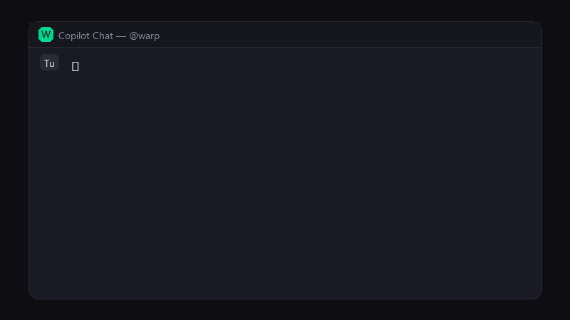

# Come creare le GIF per la Guida Rapida

La guida HTML (`GUIDA-RAPIDA.html`) contiene **10 segnaposto** per GIF animate.
Questa nota spiega come registrarle e inserirle.

---

## Elenco GIF da registrare

| # | File | Cosa registrare | Durata suggerita |
|---|------|-----------------|------------------|
| 1 | `gif-01-download-warp.gif` | Apertura sito warp.dev → click Download → installer in esecuzione | 8–12 s |
| 2 | `gif-02-verify-oz.gif` | Apertura PowerShell → `where oz` → output con percorso | 4–6 s |
| 3 | `gif-03-oz-login.gif` | Terminale: `oz auth login` → apertura browser → callback riuscito | 8–12 s |
| 4 | `gif-04-install-vsix.gif` | Terminale VS Code: `code --install-extension warp-vsc-bridge-0.1.0.vsix` → conferma | 5–8 s |
| 5 | `gif-05-reload-window.gif` | Ctrl+Shift+P → digitare "Reload" → click su Reload Window | 4–6 s |
| 6 | `gif-06-first-config.gif` | Aprire chat Copilot → digitare `@warp /config` → vedere risposta ✅ | 6–10 s |
| 7 | `gif-07-run-local.gif` | Chat: `@warp /run <prompt>` → risposta dell'agente con output | 8–15 s |
| 8 | `gif-08-init.gif` | Chat: `@warp /init` → file creati nel workspace | 6–8 s |
| 9 | `gif-09-settings.gif` | Ctrl+, → cercare "warpBridge" → modificare un parametro | 6–8 s |

## Strumenti consigliati

### Windows — ScreenToGif (gratuito, open source)
```
winget install NickeManarin.ScreenToGif
```
1. Apri ScreenToGif → **Recorder**
2. Ridimensiona il riquadro sull'area da catturare (consigliato: **800×450 px**)
3. Premi **F7** per registrare, **F8** per fermare
4. Nell'editor: taglia i frame inutili, aggiungi testo se serve
5. Salva come GIF con qualità alta (> 15 fps)

### macOS — Kap (gratuito)
```
brew install --cask kap
```

### Linux — Peek (gratuito)
```
sudo apt install peek
```

### Alternativa cross-platform — LICEcap
Scarica da [cockos.com/licecap](https://www.cockos.com/licecap/)

## Specifiche consigliate

| Proprietà | Valore |
|-----------|--------|
| Risoluzione | 800 × 450 px (16:9) |
| Frame rate | 15 fps |
| Colori | 256 (standard GIF) |
| Peso | < 2 MB per GIF |

## Come inserire nella guida

Le GIF vanno salvate nella cartella `docs/media/` con i nomi indicati sopra.

Poi, nel file `GUIDA-RAPIDA.html`, ogni segnaposto ha un attributo `data-media`
con il nome del file. Per attivare la GIF, aggiungi un tag `` dentro il
`<div class="media-placeholder">`:

```html
<!-- Prima (segnaposto) -->
<div class="media-placeholder" data-media="gif-06-first-config.gif">
  <div class="ph-icon">🎬</div>
  <div class="ph-label">GIF: Primo avvio...</div>
  <div class="ph-format">GIF · 16:9</div>
</div>

<!-- Dopo (con GIF) -->
<div class="media-placeholder" data-media="gif-06-first-config.gif">
  
</div>
```

L'immagine coprirà automaticamente il segnaposto grazie al CSS già presente.
