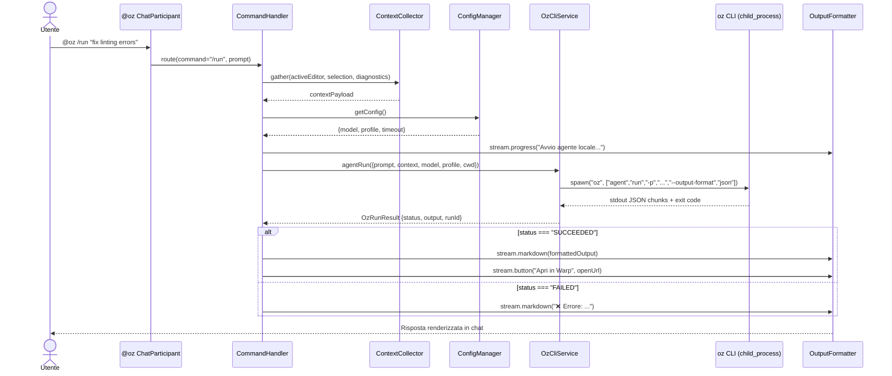
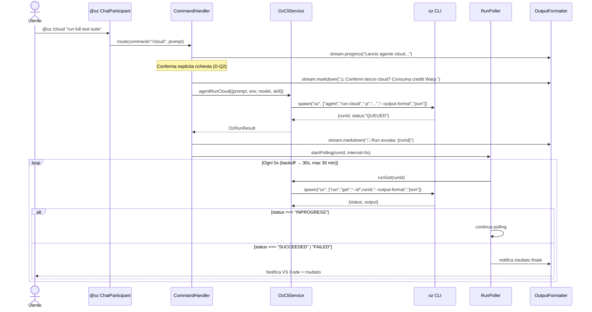

# OzBridge — Documento di Design Architetturale v1.0

**Data**: 24 febbraio 2026  
**Fase**: Design Agent (fase 2 della pipeline a 7 agenti)  
**Input**: Spec v2.0 (validata con Oz CLI reale e VS Code Chat Participant API)

---

## 1. Overview

### 1.1 Diagramma di sistema


### 1.2 Componenti e responsabilità

| Livello | Componente | Responsabilità singola |
| --- | --- | --- |
| **VS Code** | `ChatParticipant` (`@oz`) | Registrazione come chat participant, ricezione prompt, dispatch del comando |
| **VS Code** | `CommandHandler` | Routing degli 8 slash commands al service appropriato |
| **VS Code** | `ContextCollector` | Raccolta contesto IDE (file aperto, selezione, diagnostics, workspace path) |
| **VS Code** | `ConfigManager` | Lettura/validazione `vscode.workspace.getConfiguration('ozBridge')` |
| **VS Code** | `OutputFormatter` | Trasformazione `OzRunResult` → `ChatResponseStream` (markdown, progress, button, reference) |
| **Bridge** | `OzCliService` | Esecuzione Oz CLI via `child_process.spawn`, parsing JSON, gestione errori |
| **Bridge** | `RunPoller` | Polling periodico `oz run get` per task cloud asincroni, con timeout e backoff |
| **Workspace** | `.agents/skills/` | 7 file SKILL.md che mappano i 7 agenti custom a Warp Skills |
| **Workspace** | `.warp/rules/` | Regole di progetto per Oz (PROJECT.md) |

### 1.3 Struttura cartelle

```
src/
├── extension.ts              # activate()/deactivate(), registra Chat Participant
├── participant/
│   ├── handler.ts            # ChatRequestHandler principale
│   └── followups.ts          # ChatFollowupProvider
├── commands/
│   ├── router.ts             # Dispatch slash command → handler specifico
│   ├── runCommand.ts         # /run   — agent locale
│   ├── cloudCommand.ts       # /cloud — agent cloud
│   ├── statusCommand.ts      # /status — stato task
│   ├── scheduleCommand.ts    # /schedule — cron jobs
│   ├── modelsCommand.ts      # /models — lista modelli
│   ├── mcpCommand.ts         # /mcp — server MCP
│   ├── configCommand.ts      # /config — configurazione attiva
│   └── initCommand.ts        # /init  — scaffolding SKILL.md + rules
├── services/
│   ├── ozCliService.ts       # Interfaccia + Impl spawn CLI
│   ├── runPoller.ts          # Polling asincrono run cloud
│   ├── contextCollector.ts   # Raccolta contesto VS Code
│   └── configManager.ts      # Wrapper settings VS Code
├── parsers/
│   ├── jsonParser.ts         # Parse robusto output JSON (gestisce testo puro)
│   └── outputFormatter.ts    # Formattazione → ChatResponseStream
├── types/
│   └── index.ts              # Tutti i tipi/interfacce condivisi
└── test/
    ├── unit/                 # Test unitari con mock OzCliService
    └── integration/          # Test con Oz CLI reale (opzionali)
```

---

## 2. Data Flow

### 2.1 Flusso principale — `/run` (agent locale)



**Passi chiave**:

1. **Input**: l'utente digita `@oz /run "fix linting errors"` in Copilot Chat
2. **Route**: `ChatParticipant` → `CommandHandler.route("/run", prompt)`
3. **Context**: `ContextCollector.gather()` produce `ContextPayload` con:
   - `activeFilePath`: path file corrente
   - `selection`: testo selezionato (se presente)
   - `diagnostics`: errori/warning del file corrente
   - `workspacePath`: root del workspace
4. **Config**: `ConfigManager.getConfig()` → `{ model, profile, timeout, cwd }`
5. **Exec**: `OzCliService.agentRun()` → `child_process.spawn("oz", [...])` con `--output-format json`
6. **Parse**: `JsonParser.parse(stdout)` → `OzRunResult`
7. **Output**: `OutputFormatter.format(result, stream)` → `stream.markdown()` / `stream.button()`

### 2.2 Flusso cloud — `/cloud` (agent cloud + polling)



**Differenze dal flusso locale**:
- `oz agent run-cloud` ritorna immediatamente con `{ runId, status: "QUEUED" }`
- `RunPoller` avvia polling ogni 5s con backoff esponenziale (×1.5) fino a max 30s
- Timeout massimo: 30 minuti (configurabile)
- Notifica finale via `vscode.window.showInformationMessage()` + aggiornamento chat
- **Conferma esplicita** richiesta prima del lancio (decisione Q2)

### 2.3 Flussi secondari

| Flusso | Percorso |
| --- | --- |
| **Errore: Oz CLI non trovato** | `OzCliService.checkAvailability()` → `which oz` fallisce → `OutputFormatter` mostra messaggio con link installazione. L'estensione si degrada gracefully. |
| **Errore: autenticazione** | `oz` ritorna exit code != 0 con `"not logged in"` → `OutputFormatter` mostra `stream.button("Login Warp", URI("https://app.warp.dev"))` |
| **Errore: JSON parse** | `oz run list` ritorna `"No runs found."` (testo puro) → `JsonParser` intercetta, ritorna `{ items: [], rawText: "..." }` |
| **Errore: timeout** | `child_process` eccede `timeout` config → kill processo, risposta con message di timeout |
| **Config reload** | `vscode.workspace.onDidChangeConfiguration` → `ConfigManager` invalida cache |
| **CancellationToken** | Utente cancella prompt → `token.isCancellationRequested` → kill child process via `proc.kill()` |

---

## 3. Interfacce dei moduli

### 3.1 Tipi condivisi — `types/index.ts`

```typescript
// === Configurazione ===
interface WarpBridgeConfig {
  ozPath: string;                    // default: "oz" (ricerca in PATH)
  defaultModel: string;             // default: "auto"
  defaultProfile: string;           // default: "Default"
  defaultEnvironment: string;       // default: "" (nessuno)
  cloudPollingIntervalMs: number;   // default: 5000
  cloudPollingTimeoutMs: number;    // default: 1_800_000 (30 min)
  timeoutMs: number;                // default: 300_000 (5 min per locale)
  maxOutputChars: number;           // default: 5000 (decisione Q3)
}

// === Risultati Oz CLI ===
type OzRunStatus = 'QUEUED' | 'INPROGRESS' | 'SUCCEEDED' | 'FAILED' | 'UNKNOWN';

interface OzRunResult {
  runId: string | null;             // null per comandi che non producono runId
  status: OzRunStatus;
  output: string;                   // output testuale dell'agente
  exitCode: number;
  durationMs: number;
  raw: unknown;                     // JSON grezzo parsato (per debug)
}

interface OzListResult<T> {
  items: T[];
  rawText?: string;                 // presente se output non era JSON valido
}

// === Modelli Oz CLI (verificati con output reale) ===
interface OzModel {
  id: string;                       // es. "claude-4-6-opus-high", "gpt-5", "auto"
}

interface OzMcpServer {
  uuid: string;
  name: string;                     // es. "GitHub", "Notion"
}

interface OzProfile {
  id: string;                       // es. "Unsynced" (NB: non sempre UUID)
  name: string;                     // es. "Default"
}

interface OzEnvironment {
  id: string;
  name: string;
  base_image: { docker_image: string };
  github_repos: Array<{ owner: string; repo: string }>;
  setup_commands: string[];
  creator_email: string;
  last_edited: string;              // ISO 8601
  scope: string;                    // "Team" | "Personal"
}

interface OzIntegration {
  provider: string;                 // "Linear" | "Slack"
  status: string;                   // testo umano, es. "This integration is not connected."
}

interface OzSchedule {
  id: string;
  name: string;
  cron: string;
  prompt: string;
  paused: boolean;
}

// === Contesto IDE ===
interface ContextPayload {
  workspacePath: string;
  activeFilePath: string | null;
  activeFileLanguageId: string | null;
  selection: string | null;
  diagnostics: Array<{
    severity: 'error' | 'warning' | 'info' | 'hint';
    message: string;
    range: { startLine: number; endLine: number };
  }>;
}

// === Errori ===
enum OzCliErrorKind {
  NOT_FOUND             = 'NOT_FOUND',
  NOT_AUTHENTICATED     = 'NOT_AUTHENTICATED',
  INSUFFICIENT_CREDITS  = 'INSUFFICIENT_CREDITS', // v1.0.1: rilevato da stderr / HTTP 402-429
  STALLED               = 'STALLED',              // v1.0.1: nessun output per `idleTimeoutMs`
  TIMEOUT               = 'TIMEOUT',
  PARSE_ERROR           = 'PARSE_ERROR',
  CLI_ERROR             = 'CLI_ERROR',
  CANCELLED             = 'CANCELLED',
}

class OzCliError extends Error {
  constructor(
    public readonly kind: OzCliErrorKind,
    message: string,
    public readonly exitCode?: number,
    public readonly stderr?: string,
  ) {
    super(message);
    this.name = 'OzCliError';
  }
}

// === Mappa Agenti → Skill ===
const AGENT_SKILL_MAP: Record<string, string> = {
  'spec':        '1-spec-agent',
  'design':      '2-design-agent',
  'implement':   '3-implement-agent',
  'review':      '4-review-agent',
  'test':        '5-test-agent',
  'deploy':      '6-deploy-agent',
  'maintenance': '7-maintenance-agent',
};
```

### 3.2 `IOzCliService` — `services/ozCliService.ts`

```typescript
interface IOzCliService {
  // === Lifecycle ===
  checkAvailability(): Promise<{
    available: boolean;
    version: string | null;
    path: string | null;
  }>;

  // === Agent execution ===
  agentRun(opts: {
    prompt: string;
    model?: string;
    profile?: string;
    skill?: string;
    cwd?: string;
    cancellation?: CancellationToken;
  }): Promise<OzRunResult>;

  agentRunCloud(opts: {
    prompt: string;
    model?: string;
    environment?: string;
    skill?: string;
    cancellation?: CancellationToken;
  }): Promise<OzRunResult>;

  // === Run management ===
  runList(): Promise<OzListResult<{ id: string; status: OzRunStatus }>>;
  runGet(runId: string): Promise<OzRunResult>;

  // === Schedules ===
  scheduleCreate(opts: {
    name: string;
    cron: string;
    prompt: string;
    skill?: string;
    environment?: string;
  }): Promise<OzSchedule>;
  scheduleList(): Promise<OzListResult<OzSchedule>>;
  schedulePause(id: string): Promise<void>;
  scheduleUnpause(id: string): Promise<void>;
  scheduleDelete(id: string): Promise<void>;

  // === Discovery ===
  modelList(): Promise<OzListResult<OzModel>>;
  mcpList(): Promise<OzListResult<OzMcpServer>>;
  profileList(): Promise<OzListResult<OzProfile>>;
  environmentList(): Promise<OzListResult<OzEnvironment>>;
  integrationList(): Promise<OzListResult<OzIntegration>>;
}
```

**Contratto di implementazione**:
- Ogni metodo invoca `spawn(this.ozPath, args, { cwd, timeout })`
- Appende sempre `--output-format json` agli args
- Gestisce `exit code !== 0` come eccezione tipizzata `OzCliError`
- Delega parsing a `JsonParser.parse()`
- Supporta `CancellationToken` per kill del child process

### 3.3 `IJsonParser` — `parsers/jsonParser.ts`

```typescript
interface IJsonParser {
  /**
   * Tenta di parsare stdout come JSON.
   * Se fallisce (es. "No runs found."), ritorna { parsed: null, rawText: stdout }.
   * Gestisce anche output multi-riga dove solo una riga è JSON.
   */
  parse<T>(stdout: string): { parsed: T | null; rawText: string };

  /**
   * Versione tipizzata che lancia se il parse fallisce.
   */
  parseOrThrow<T>(stdout: string, context: string): T;
}
```

### 3.4 `IContextCollector` — `services/contextCollector.ts`

```typescript
interface IContextCollector {
  /**
   * Raccoglie contesto dall'IDE corrente.
   * Non fallisce mai: ritorna campi null se non disponibili.
   */
  gather(): ContextPayload;

  /**
   * Formatta il contesto come blocco testuale da iniettare nel prompt.
   * Formato:
   *   [CONTEXT]
   *   Workspace: /path/to/workspace
   *   File: src/main.ts (typescript)
   *   Selection: lines 10-25
   *   Diagnostics: 2 errors, 1 warning
   *   [/CONTEXT]
   */
  formatForPrompt(payload: ContextPayload): string;
}
```

### 3.5 `IConfigManager` — `services/configManager.ts`

```typescript
interface IConfigManager {
  getConfig(): WarpBridgeConfig;
  onConfigChanged: vscode.Event<WarpBridgeConfig>;
  dispose(): void;
}
```

### 3.6 `IRunPoller` — `services/runPoller.ts`

```typescript
interface IRunPoller {
  /**
   * Avvia polling per un runId cloud.
   * Risolve quando lo stato diventa terminale (SUCCEEDED|FAILED) o timeout.
   * Supporta cancellazione.
   *
   * Policy: intervallo iniziale 5s, backoff ×1.5 fino a max 30s,
   *         timeout totale 30 min (configurabile).
   */
  poll(
    runId: string,
    onProgress: (status: OzRunStatus) => void,
    cancellation?: CancellationToken
  ): Promise<OzRunResult>;

  /**
   * Annulla tutti i polling attivi (chiamato in deactivate).
   */
  disposeAll(): void;
}
```

### 3.7 `ICommandRouter` — `commands/router.ts`

```typescript
interface ICommandRouter {
  /**
   * Crea un ChatRequestHandler che route i comandi.
   */
  createHandler(): vscode.ChatRequestHandler;
}
```

**Tabella routing**:

| `request.command` | Handler file | Oz CLI command |
| --- | --- | --- |
| `run` | `runCommand.ts` | `oz agent run` |
| `cloud` | `cloudCommand.ts` | `oz agent run-cloud` |
| `status` | `statusCommand.ts` | `oz run list` / `oz run get` |
| `schedule` | `scheduleCommand.ts` | `oz schedule *` |
| `models` | `modelsCommand.ts` | `oz model list` |
| `mcp` | `mcpCommand.ts` | `oz mcp list` |
| `config` | `configCommand.ts` | Lettura config locale |
| `init` | `initCommand.ts` | Scaffolding SKILL.md + rules |
| *(nessuno)* | `runCommand.ts` | Default: esegue come `/run` |

### 3.8 `IOutputFormatter` — `parsers/outputFormatter.ts`

```typescript
interface IOutputFormatter {
  /**
   * Formatta un OzRunResult nel ChatResponseStream.
   * Tronca output a maxOutputChars (default 5000) con link "Mostra tutto".
   */
  formatRunResult(result: OzRunResult, stream: vscode.ChatResponseStream): void;

  /**
   * Formatta una lista generica come tabella markdown.
   */
  formatList<T>(
    items: OzListResult<T>,
    columns: Array<keyof T>,
    stream: vscode.ChatResponseStream
  ): void;

  /**
   * Mostra errore con azione suggerita (button login, link installazione, etc.).
   */
  formatError(error: OzCliError, stream: vscode.ChatResponseStream): void;
}
```

### 3.9 Chat Participant — registrazione `package.json`

```jsonc
{
  "contributes": {
    "chatParticipants": [{
      "id": "ozbridge.oz",
      "name": "warp",
      "fullName": "OzBridge",
      "description": "Run Warp Oz agents from VS Code",
      "isSticky": true,
      "commands": [
        { "name": "run",      "description": "Run an Oz agent locally in the current workspace" },
        { "name": "cloud",    "description": "Run an Oz agent in the cloud (consumes credits)" },
        { "name": "status",   "description": "Check status of cloud agent runs" },
        { "name": "schedule", "description": "Create and manage scheduled agent runs" },
        { "name": "models",   "description": "List available AI models" },
        { "name": "mcp",      "description": "List configured MCP servers" },
        { "name": "config",   "description": "Show current OzBridge configuration" },
        { "name": "init",     "description": "Scaffold Warp Skills and Rules for this workspace" }
      ]
    }]
  }
}
```

### 3.10 VS Code Settings — `configuration` in `package.json`

```jsonc
{
  "contributes": {
    "configuration": {
      "title": "OzBridge",
      "properties": {
        "ozBridge.ozPath": {
          "type": "string",
          "default": "oz",
          "description": "Path to the Oz CLI executable"
        },
        "ozBridge.defaultModel": {
          "type": "string",
          "default": "auto",
          "description": "Default AI model for agent runs"
        },
        "ozBridge.defaultProfile": {
          "type": "string",
          "default": "Default",
          "description": "Default Oz agent profile"
        },
        "ozBridge.defaultEnvironment": {
          "type": "string",
          "default": "",
          "description": "Default cloud environment name (empty = none)"
        },
        "ozBridge.cloudPollingIntervalMs": {
          "type": "number",
          "default": 5000,
          "description": "Initial polling interval for cloud runs (ms)"
        },
        "ozBridge.cloudPollingTimeoutMs": {
          "type": "number",
          "default": 1800000,
          "description": "Max polling duration for cloud runs (ms, default 30 min)"
        },
        "ozBridge.timeoutMs": {
          "type": "number",
          "default": 300000,
          "description": "Timeout for local agent runs (ms, default 5 min)"
        },
        "ozBridge.maxOutputChars": {
          "type": "number",
          "default": 5000,
          "description": "Max characters shown in chat before truncation"
        }
      }
    }
  }
}
```

---

## 4. Decisioni di design

### D1 — `child_process.spawn` vs TypeScript SDK (`oz-sdk-typescript`)

| Criterio | `child_process` | SDK TypeScript |
| --- | --- | --- |
| Dipendenze | Zero (Node.js built-in) | Package npm esterno |
| Aggiornamenti | Automatici con Warp updates | Richiede npm update |
| Feature parity | 100% — interfaccia primaria Warp | Potenzialmente in ritardo |
| Debugging | `--output-format json` visibile | Oggetti typed |
| Streaming | Basato su stdout readline | Promise-based |

**Decisione**: `child_process.spawn` con `--output-format json`.  
**Motivazione**: zero dipendenze runtime (NFR-06), feature parity garantita, l'utente ha già Oz CLI installata.

### D2 — Parsing robusto vs strict JSON

**Decisione**: parser a 2 livelli (`JsonParser`).  
**Motivazione**: validato empiricamente che `oz run list` ritorna `"No runs found."` come testo puro quando vuoto. Il parser tenta `JSON.parse()`, se fallisce preserva il testo grezzo.

### D3 — Polling vs WebSocket per task cloud

**Decisione**: polling con backoff esponenziale (5s → 30s, max 30 min).  
**Motivazione**: Oz CLI non espone WebSocket/SSE. `oz run get` è l'unico meccanismo.

### D4 — Un Chat Participant vs più participant

**Decisione**: singolo participant `@oz` con 8 slash commands.  
**Motivazione**: VS Code raccomanda "one participant per extension".

### D5 — Context injection: path + selezione + diagnostics (decisione Q1)

**Decisione**: contesto automatico con path, selezione e diagnostics. NO file intero.  
**Formato**:
```
[CONTEXT]
Workspace: /path/to/workspace
File: src/main.ts (typescript)
Selection (lines 10-25):
<selected text>
Diagnostics: 2 errors, 1 warning
- Error L12: Cannot find name 'foo'
- Warning L18: Unused variable 'bar'
[/CONTEXT]

<prompt utente>
```

### D6 — Conferma esplicita per `/cloud` (decisione Q2)

**Decisione**: sempre conferma prima di lanciare un agent cloud.  
**UX**: follow-up button "Conferma lancio cloud" dopo il messaggio di warning.

### D7 — Troncamento output (decisione Q3)

**Decisione**: troncare a 5000 caratteri con link "Mostra tutto" (copia negli appunti o apre in editor).

### D8 — Scaffolding via `/init` (decisione Q4)

**Decisione**: comando `@oz /init` crea:
- `.agents/skills/{1-spec-agent,...,7-maintenance-agent}/SKILL.md` — 7 file
- `.warp/rules/PROJECT.md` — regole di progetto base
- Non sovrascrive file esistenti

### D9 — Skill mapping: dichiarativo

**Decisione**: mappa statica `AGENT_SKILL_MAP` in codice + 7 SKILL.md.  
**Motivazione**: i 7 agenti sono stabili. Se `--skill` è esplicito, il mapping viene bypassato.

### D10 — Error categorization

**Decisione**: errori tipizzati con `OzCliErrorKind` enum (6 categorie).  
**Motivazione**: ogni tipo richiede UX diversa (button login, link installazione, retry).

### D11 — Nessun state globale

**Decisione**: nessun database locale, nessun file di stato.  
**Motivazione**: persistenza delegata a Warp. Estensione stateless. Settings in VS Code nativo.

---

## 5. Rischi e domande aperte

### 5.1 Rischi identificati

| ID | Rischio | Impatto | Probabilità | Mitigazione |
| --- | --- | --- | --- | --- |
| **R1** | `oz run list` ritorna testo puro quando vuoto | Parse failure → crash | Alta (verificato) | `JsonParser` con fallback (D2) |
| **R2** | ID profilo `"Unsynced"` non è UUID | Type mismatch se si assume UUID | Media | Tipo `string` generico |
| **R3** | Cloud agent consuma crediti (BYOK non supportato) | Run costose involontarie | Media | Conferma esplicita (D6) |
| **R4** | Output agent molto lungo | Timeout/freeze chat VS Code | Media | Troncamento a 15000 char (D7) |
| **R5** | Evoluzione rapida Oz CLI (nuovi comandi, cambi JSON) | Rottura parser | Bassa | `--output-format json` è stabile. Test di regressione. |
| **R6** | Cancellazione task cloud impossibile via CLI | Run continua dopo cancel | Alta (design Warp) | Documentare: cancel ferma solo polling |
| **R7** | `oz agent run` sincrono e bloccante | No progresso granulare locale | Media | Streaming stdout con `readline` |

### 5.2 Decisioni confermate (ex domande aperte)

| ID | Domanda | Decisione |
| --- | --- | --- |
| **Q1** | Contesto iniettato | Path + selezione + diagnostics (no file intero) |
| **Q2** | Conferma per `/cloud` | Sempre conferma |
| **Q3** | Troncamento output | 5000 caratteri con "Mostra tutto" |
| **Q4** | Scaffolding skills/rules | Comando `@oz /init` (8° slash command) |

---

## 6. Dipendenze

### Build-time (devDependencies)

| Package | Scopo |
| --- | --- |
| `@types/vscode` | Tipi VS Code API |
| `typescript` | Compilazione |
| `esbuild` | Bundling estensione |
| `@vscode/test-electron` | Test integration (opzionale) |

### Runtime

**Nessuna dipendenza runtime** oltre a Node.js built-in (`child_process`, `readline`, `path`, `os`).

### Esterne

| Dipendenza | Tipo | Obbligatoria |
| --- | --- | --- |
| Oz CLI (`oz` / `oz.cmd`) | Binario in PATH | Sì (graceful degradation se assente) |
| Account Warp autenticato | Servizio cloud | Solo per `/cloud`, `/schedule` |
| Crediti Warp (≥20) | Billing | Solo per `/cloud` |

---

## 7. Prossimi passi

1. **Implement Agent** (fase 3): genera il codice TypeScript seguendo le interfacce definite sopra
2. **Review Agent** (fase 4): verifica aderenza al design
3. **Test Agent** (fase 5): scrive test unitari con mock `IOzCliService`
4. **Deploy Agent** (fase 6): configura packaging `.vsix` e pubblicazione
5. **Maintenance Agent** (fase 7): monitora evoluzione Oz CLI e aggiorna parser
