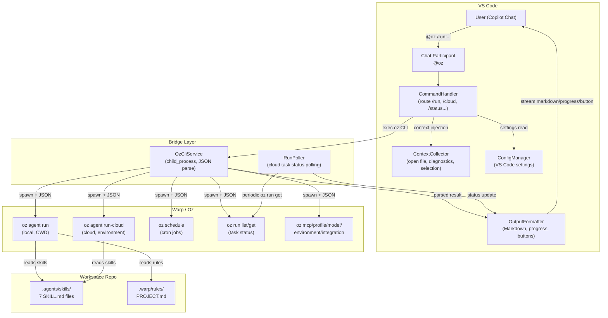
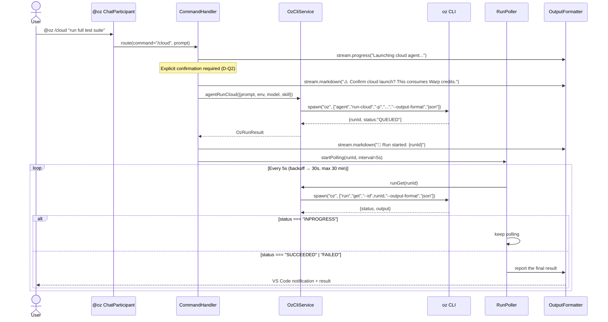

# OzBridge — Architectural Design Document v1.0

**Date**: 24 February 2026  
**Phase**: Design Agent (phase 2 of the 7-agent pipeline)  
**Input**: Spec v2.0 (validated against the real Oz CLI and the VS Code Chat Participant API)

> Historical record. This document captures the design as of February 2026 and is
> deliberately not updated to track the implementation; see the source tree and
> `CHANGELOG.md` for the current state.

---

## 1. Overview

### 1.1 System diagram



### 1.2 Components and responsibilities

| Layer | Component | Single responsibility |
| --- | --- | --- |
| **VS Code** | `ChatParticipant` (`@oz`) | Registration as a chat participant, prompt intake, command dispatch |
| **VS Code** | `CommandHandler` | Routing the 8 slash commands to the appropriate service |
| **VS Code** | `ContextCollector` | Gathering IDE context (open file, selection, diagnostics, workspace path) |
| **VS Code** | `ConfigManager` | Reading and validating `vscode.workspace.getConfiguration('ozBridge')` |
| **VS Code** | `OutputFormatter` | Turning `OzRunResult` into `ChatResponseStream` (markdown, progress, button, reference) |
| **Bridge** | `OzCliService` | Running the Oz CLI via `child_process.spawn`, JSON parsing, error handling |
| **Bridge** | `RunPoller` | Periodic `oz run get` polling for asynchronous cloud tasks, with timeout and backoff |
| **Workspace** | `.agents/skills/` | 7 SKILL.md files mapping the 7 custom agents onto Warp Skills |
| **Workspace** | `.warp/rules/` | Project rules for Oz (PROJECT.md) |

### 1.3 Folder structure

```
src/
├── extension.ts              # activate()/deactivate(), registers the Chat Participant
├── participant/
│   ├── handler.ts            # Main ChatRequestHandler
│   └── followups.ts          # ChatFollowupProvider
├── commands/
│   ├── router.ts             # Dispatch slash command → specific handler
│   ├── runCommand.ts         # /run   — local agent
│   ├── cloudCommand.ts       # /cloud — cloud agent
│   ├── statusCommand.ts      # /status — task status
│   ├── scheduleCommand.ts    # /schedule — cron jobs
│   ├── modelsCommand.ts      # /models — model list
│   ├── mcpCommand.ts         # /mcp — MCP servers
│   ├── configCommand.ts      # /config — active configuration
│   └── initCommand.ts        # /init  — SKILL.md + rules scaffolding
├── services/
│   ├── ozCliService.ts       # Interface + spawn-based implementation
│   ├── runPoller.ts          # Asynchronous cloud run polling
│   ├── contextCollector.ts   # VS Code context gathering
│   └── configManager.ts      # VS Code settings wrapper
├── parsers/
│   ├── jsonParser.ts         # Robust JSON output parsing (handles plain text)
│   └── outputFormatter.ts    # Formatting → ChatResponseStream
├── types/
│   └── index.ts              # All shared types and interfaces
└── test/
    ├── unit/                 # Unit tests with a mocked OzCliService
    └── integration/          # Tests against the real Oz CLI (optional)
```

---

## 2. Data flow

### 2.1 Main flow — `/run` (local agent)


**Key steps**:

1. **Input**: the user types `@oz /run "fix linting errors"` in Copilot Chat
2. **Route**: `ChatParticipant` → `CommandHandler.route("/run", prompt)`
3. **Context**: `ContextCollector.gather()` produces a `ContextPayload` holding:
   - `activeFilePath`: path of the current file
   - `selection`: selected text, if any
   - `diagnostics`: errors and warnings for the current file
   - `workspacePath`: workspace root
4. **Config**: `ConfigManager.getConfig()` → `{ model, profile, timeout, cwd }`
5. **Exec**: `OzCliService.agentRun()` → `child_process.spawn("oz", [...])` with `--output-format json`
6. **Parse**: `JsonParser.parse(stdout)` → `OzRunResult`
7. **Output**: `OutputFormatter.format(result, stream)` → `stream.markdown()` / `stream.button()`

### 2.2 Cloud flow — `/cloud` (cloud agent + polling)



**Differences from the local flow**:
- `oz agent run-cloud` returns immediately with `{ runId, status: "QUEUED" }`
- `RunPoller` polls every 5s with exponential backoff (×1.5) up to a 30s ceiling
- Maximum timeout: 30 minutes (configurable)
- Final notification through `vscode.window.showInformationMessage()` plus a chat update
- **Explicit confirmation** required before launching (decision Q2)

### 2.3 Secondary flows

| Flow | Path |
| --- | --- |
| **Error: Oz CLI not found** | `OzCliService.checkAvailability()` → `which oz` fails → `OutputFormatter` shows a message with an install link. The extension degrades gracefully. |
| **Error: authentication** | `oz` exits non-zero with `"not logged in"` → `OutputFormatter` shows `stream.button("Login Warp", URI("https://app.warp.dev"))` |
| **Error: JSON parse** | `oz run list` returns `"No runs found."` as plain text → `JsonParser` intercepts it and returns `{ items: [], rawText: "..." }` |
| **Error: timeout** | `child_process` exceeds the configured `timeout` → kill the process, respond with a timeout message |
| **Config reload** | `vscode.workspace.onDidChangeConfiguration` → `ConfigManager` invalidates its cache |
| **CancellationToken** | User cancels the prompt → `token.isCancellationRequested` → kill the child process via `proc.kill()` |

---

## 3. Module interfaces

### 3.1 Shared types — `types/index.ts`

```typescript
// === Configuration ===
interface WarpBridgeConfig {
  ozPath: string;                    // default: "oz" (resolved from PATH)
  defaultModel: string;             // default: "auto"
  defaultProfile: string;           // default: "Default"
  defaultEnvironment: string;       // default: "" (none)
  cloudPollingIntervalMs: number;   // default: 5000
  cloudPollingTimeoutMs: number;    // default: 1_800_000 (30 min)
  timeoutMs: number;                // default: 300_000 (5 min for local runs)
  maxOutputChars: number;           // default: 5000 (decision Q3)
}

// === Oz CLI results ===
type OzRunStatus = 'QUEUED' | 'INPROGRESS' | 'SUCCEEDED' | 'FAILED' | 'UNKNOWN';

interface OzRunResult {
  runId: string | null;             // null for commands that produce no runId
  status: OzRunStatus;
  output: string;                   // the agent's textual output
  exitCode: number;
  durationMs: number;
  raw: unknown;                     // parsed raw JSON, for debugging
}

interface OzListResult<T> {
  items: T[];
  rawText?: string;                 // present when the output was not valid JSON
}

// === Oz CLI models (verified against real output) ===
interface OzModel {
  id: string;                       // e.g. "claude-4-6-opus-high", "gpt-5", "auto"
}

interface OzMcpServer {
  uuid: string;
  name: string;                     // e.g. "GitHub", "Notion"
}

interface OzProfile {
  id: string;                       // e.g. "Unsynced" (note: not always a UUID)
  name: string;                     // e.g. "Default"
}

interface OzEnvironment {
  id: string;
  name: string;
  base_image: { docker_image: string };
  github_repos: Array<{ owner: string; repo: string }>;
  setup_commands: string[];
  creator_email: string;
  last_edited: string;              // ISO 8601
  scope: string;                    // "Team" | "Personal"
}

interface OzIntegration {
  provider: string;                 // "Linear" | "Slack"
  status: string;                   // human-readable text, e.g. "This integration is not connected."
}

interface OzSchedule {
  id: string;
  name: string;
  cron: string;
  prompt: string;
  paused: boolean;
}

// === IDE context ===
interface ContextPayload {
  workspacePath: string;
  activeFilePath: string | null;
  activeFileLanguageId: string | null;
  selection: string | null;
  diagnostics: Array<{
    severity: 'error' | 'warning' | 'info' | 'hint';
    message: string;
    range: { startLine: number; endLine: number };
  }>;
}

// === Errors ===
enum OzCliErrorKind {
  NOT_FOUND             = 'NOT_FOUND',
  NOT_AUTHENTICATED     = 'NOT_AUTHENTICATED',
  INSUFFICIENT_CREDITS  = 'INSUFFICIENT_CREDITS', // v1.0.1: detected from stderr / HTTP 402-429
  STALLED               = 'STALLED',              // v1.0.1: no output for `idleTimeoutMs`
  TIMEOUT               = 'TIMEOUT',
  PARSE_ERROR           = 'PARSE_ERROR',
  CLI_ERROR             = 'CLI_ERROR',
  CANCELLED             = 'CANCELLED',
}

class OzCliError extends Error {
  constructor(
    public readonly kind: OzCliErrorKind,
    message: string,
    public readonly exitCode?: number,
    public readonly stderr?: string,
  ) {
    super(message);
    this.name = 'OzCliError';
  }
}

// === Agent → Skill map ===
const AGENT_SKILL_MAP: Record<string, string> = {
  'spec':        '1-spec-agent',
  'design':      '2-design-agent',
  'implement':   '3-implement-agent',
  'review':      '4-review-agent',
  'test':        '5-test-agent',
  'deploy':      '6-deploy-agent',
  'maintenance': '7-maintenance-agent',
};
```

### 3.2 `IOzCliService` — `services/ozCliService.ts`

```typescript
interface IOzCliService {
  // === Lifecycle ===
  checkAvailability(): Promise<{
    available: boolean;
    version: string | null;
    path: string | null;
  }>;

  // === Agent execution ===
  agentRun(opts: {
    prompt: string;
    model?: string;
    profile?: string;
    skill?: string;
    cwd?: string;
    cancellation?: CancellationToken;
  }): Promise<OzRunResult>;

  agentRunCloud(opts: {
    prompt: string;
    model?: string;
    environment?: string;
    skill?: string;
    cancellation?: CancellationToken;
  }): Promise<OzRunResult>;

  // === Run management ===
  runList(): Promise<OzListResult<{ id: string; status: OzRunStatus }>>;
  runGet(runId: string): Promise<OzRunResult>;

  // === Schedules ===
  scheduleCreate(opts: {
    name: string;
    cron: string;
    prompt: string;
    skill?: string;
    environment?: string;
  }): Promise<OzSchedule>;
  scheduleList(): Promise<OzListResult<OzSchedule>>;
  schedulePause(id: string): Promise<void>;
  scheduleUnpause(id: string): Promise<void>;
  scheduleDelete(id: string): Promise<void>;

  // === Discovery ===
  modelList(): Promise<OzListResult<OzModel>>;
  mcpList(): Promise<OzListResult<OzMcpServer>>;
  profileList(): Promise<OzListResult<OzProfile>>;
  environmentList(): Promise<OzListResult<OzEnvironment>>;
  integrationList(): Promise<OzListResult<OzIntegration>>;
}
```

**Implementation contract**:
- Every method calls `spawn(this.ozPath, args, { cwd, timeout })`
- `--output-format json` is always appended to the arguments
- A non-zero exit code becomes a typed `OzCliError`
- Parsing is delegated to `JsonParser.parse()`
- `CancellationToken` is supported and kills the child process

### 3.3 `IJsonParser` — `parsers/jsonParser.ts`

```typescript
interface IJsonParser {
  /**
   * Attempts to parse stdout as JSON.
   * On failure (e.g. "No runs found."), returns { parsed: null, rawText: stdout }.
   * Also handles multi-line output where only one line is JSON.
   */
  parse<T>(stdout: string): { parsed: T | null; rawText: string };

  /**
   * Typed variant that throws when parsing fails.
   */
  parseOrThrow<T>(stdout: string, context: string): T;
}
```

### 3.4 `IContextCollector` — `services/contextCollector.ts`

```typescript
interface IContextCollector {
  /**
   * Gathers context from the current IDE state.
   * Never fails: unavailable fields come back as null.
   */
  gather(): ContextPayload;

  /**
   * Formats the context as a text block to inject into the prompt.
   * Format:
   *   [CONTEXT]
   *   Workspace: /path/to/workspace
   *   File: src/main.ts (typescript)
   *   Selection: lines 10-25
   *   Diagnostics: 2 errors, 1 warning
   *   [/CONTEXT]
   */
  formatForPrompt(payload: ContextPayload): string;
}
```

### 3.5 `IConfigManager` — `services/configManager.ts`

```typescript
interface IConfigManager {
  getConfig(): WarpBridgeConfig;
  onConfigChanged: vscode.Event<WarpBridgeConfig>;
  dispose(): void;
}
```

### 3.6 `IRunPoller` — `services/runPoller.ts`

```typescript
interface IRunPoller {
  /**
   * Starts polling a cloud runId.
   * Resolves when the status becomes terminal (SUCCEEDED|FAILED) or on timeout.
   * Supports cancellation.
   *
   * Policy: 5s initial interval, ×1.5 backoff up to a 30s ceiling,
   *         30 min total timeout (configurable).
   */
  poll(
    runId: string,
    onProgress: (status: OzRunStatus) => void,
    cancellation?: CancellationToken
  ): Promise<OzRunResult>;

  /**
   * Cancels every active poll (called from deactivate).
   */
  disposeAll(): void;
}
```

### 3.7 `ICommandRouter` — `commands/router.ts`

```typescript
interface ICommandRouter {
  /**
   * Builds a ChatRequestHandler that routes commands.
   */
  createHandler(): vscode.ChatRequestHandler;
}
```

**Routing table**:

| `request.command` | Handler file | Oz CLI command |
| --- | --- | --- |
| `run` | `runCommand.ts` | `oz agent run` |
| `cloud` | `cloudCommand.ts` | `oz agent run-cloud` |
| `status` | `statusCommand.ts` | `oz run list` / `oz run get` |
| `schedule` | `scheduleCommand.ts` | `oz schedule *` |
| `models` | `modelsCommand.ts` | `oz model list` |
| `mcp` | `mcpCommand.ts` | `oz mcp list` |
| `config` | `configCommand.ts` | Reads local configuration |
| `init` | `initCommand.ts` | SKILL.md + rules scaffolding |
| *(none)* | `runCommand.ts` | Default: behaves as `/run` |

### 3.8 `IOutputFormatter` — `parsers/outputFormatter.ts`

```typescript
interface IOutputFormatter {
  /**
   * Formats an OzRunResult into the ChatResponseStream.
   * Truncates output at maxOutputChars (default 5000) with a "Show all" link.
   */
  formatRunResult(result: OzRunResult, stream: vscode.ChatResponseStream): void;

  /**
   * Formats a generic list as a markdown table.
   */
  formatList<T>(
    items: OzListResult<T>,
    columns: Array<keyof T>,
    stream: vscode.ChatResponseStream
  ): void;

  /**
   * Shows an error with a suggested action (login button, install link, etc.).
   */
  formatError(error: OzCliError, stream: vscode.ChatResponseStream): void;
}
```

### 3.9 Chat Participant — `package.json` registration

```jsonc
{
  "contributes": {
    "chatParticipants": [{
      "id": "ozbridge.oz",
      "name": "warp",
      "fullName": "OzBridge",
      "description": "Run Warp Oz agents from VS Code",
      "isSticky": true,
      "commands": [
        { "name": "run",      "description": "Run an Oz agent locally in the current workspace" },
        { "name": "cloud",    "description": "Run an Oz agent in the cloud (consumes credits)" },
        { "name": "status",   "description": "Check status of cloud agent runs" },
        { "name": "schedule", "description": "Create and manage scheduled agent runs" },
        { "name": "models",   "description": "List available AI models" },
        { "name": "mcp",      "description": "List configured MCP servers" },
        { "name": "config",   "description": "Show current OzBridge configuration" },
        { "name": "init",     "description": "Scaffold Warp Skills and Rules for this workspace" }
      ]
    }]
  }
}
```

### 3.10 VS Code settings — `configuration` in `package.json`

```jsonc
{
  "contributes": {
    "configuration": {
      "title": "OzBridge",
      "properties": {
        "ozBridge.ozPath": {
          "type": "string",
          "default": "oz",
          "description": "Path to the Oz CLI executable"
        },
        "ozBridge.defaultModel": {
          "type": "string",
          "default": "auto",
          "description": "Default AI model for agent runs"
        },
        "ozBridge.defaultProfile": {
          "type": "string",
          "default": "Default",
          "description": "Default Oz agent profile"
        },
        "ozBridge.defaultEnvironment": {
          "type": "string",
          "default": "",
          "description": "Default cloud environment name (empty = none)"
        },
        "ozBridge.cloudPollingIntervalMs": {
          "type": "number",
          "default": 5000,
          "description": "Initial polling interval for cloud runs (ms)"
        },
        "ozBridge.cloudPollingTimeoutMs": {
          "type": "number",
          "default": 1800000,
          "description": "Max polling duration for cloud runs (ms, default 30 min)"
        },
        "ozBridge.timeoutMs": {
          "type": "number",
          "default": 300000,
          "description": "Timeout for local agent runs (ms, default 5 min)"
        },
        "ozBridge.maxOutputChars": {
          "type": "number",
          "default": 5000,
          "description": "Max characters shown in chat before truncation"
        }
      }
    }
  }
}
```

---

## 4. Design decisions

### D1 — `child_process.spawn` vs the TypeScript SDK (`oz-sdk-typescript`)

| Criterion | `child_process` | TypeScript SDK |
| --- | --- | --- |
| Dependencies | None (Node.js built-in) | External npm package |
| Updates | Automatic, with Warp updates | Requires an npm update |
| Feature parity | 100% — Warp's primary interface | Potentially lagging |
| Debugging | `--output-format json` is visible | Typed objects |
| Streaming | stdout readline based | Promise based |

**Decision**: `child_process.spawn` with `--output-format json`.  
**Rationale**: zero runtime dependencies (NFR-06), guaranteed feature parity, and the user already has the Oz CLI installed.

### D2 — Robust parsing vs strict JSON

**Decision**: a two-level parser (`JsonParser`).  
**Rationale**: empirically confirmed that `oz run list` returns `"No runs found."` as plain text when empty. The parser attempts `JSON.parse()` and preserves the raw text on failure.

### D3 — Polling vs WebSocket for cloud tasks

**Decision**: polling with exponential backoff (5s → 30s, 30 min cap).  
**Rationale**: the Oz CLI exposes no WebSocket or SSE. `oz run get` is the only mechanism available.

### D4 — One Chat Participant vs several

**Decision**: a single `@oz` participant with 8 slash commands.  
**Rationale**: VS Code recommends "one participant per extension".

### D5 — Context injection: path + selection + diagnostics (decision Q1)

**Decision**: automatic context carrying path, selection and diagnostics. No whole-file content.  
**Format**:
```
[CONTEXT]
Workspace: /path/to/workspace
File: src/main.ts (typescript)
Selection (lines 10-25):
<selected text>
Diagnostics: 2 errors, 1 warning
- Error L12: Cannot find name 'foo'
- Warning L18: Unused variable 'bar'
[/CONTEXT]

<user prompt>
```

### D6 — Explicit confirmation for `/cloud` (decision Q2)

**Decision**: always confirm before launching a cloud agent.  
**UX**: a "Confirm cloud launch" follow-up button after the warning message.

### D7 — Output truncation (decision Q3)

**Decision**: truncate at 5000 characters with a "Show all" link (copies to the clipboard or opens in an editor).

### D8 — Scaffolding through `/init` (decision Q4)

**Decision**: the `@oz /init` command creates:
- `.agents/skills/{1-spec-agent,...,7-maintenance-agent}/SKILL.md` — 7 files
- `.warp/rules/PROJECT.md` — baseline project rules
- Never overwrites existing files

### D9 — Skill mapping: declarative

**Decision**: a static `AGENT_SKILL_MAP` in code plus 7 SKILL.md files.  
**Rationale**: the 7 agents are stable. An explicit `--skill` bypasses the mapping.

### D10 — Error categorisation

**Decision**: typed errors through the `OzCliErrorKind` enum (6 categories).  
**Rationale**: each kind calls for different UX (login button, install link, retry).

### D11 — No global state

**Decision**: no local database, no state file.  
**Rationale**: persistence is delegated to Warp. The extension is stateless. Settings live in native VS Code configuration.

---

## 5. Risks and open questions

### 5.1 Identified risks

| ID | Risk | Impact | Likelihood | Mitigation |
| --- | --- | --- | --- | --- |
| **R1** | `oz run list` returns plain text when empty | Parse failure → crash | High (verified) | `JsonParser` with fallback (D2) |
| **R2** | The `"Unsynced"` profile id is not a UUID | Type mismatch if a UUID is assumed | Medium | Plain `string` type |
| **R3** | Cloud agents consume credits (BYOK unsupported) | Unintended expensive runs | Medium | Explicit confirmation (D6) |
| **R4** | Very long agent output | VS Code chat timeout or freeze | Medium | Truncation at 15000 chars (D7) |
| **R5** | Fast Oz CLI evolution (new commands, JSON changes) | Parser breakage | Low | `--output-format json` is stable. Regression tests. |
| **R6** | Cloud tasks cannot be cancelled through the CLI | The run continues after cancel | High (Warp design) | Document it: cancel only stops polling |
| **R7** | `oz agent run` is synchronous and blocking | No granular local progress | Medium | Stream stdout with `readline` |

### 5.2 Settled decisions (formerly open questions)

| ID | Question | Decision |
| --- | --- | --- |
| **Q1** | What context to inject | Path + selection + diagnostics (no whole file) |
| **Q2** | Confirmation for `/cloud` | Always confirm |
| **Q3** | Output truncation | 5000 characters with "Show all" |
| **Q4** | Skills/rules scaffolding | The `@oz /init` command (8th slash command) |

---

## 6. Dependencies

### Build time (devDependencies)

| Package | Purpose |
| --- | --- |
| `@types/vscode` | VS Code API types |
| `typescript` | Compilation |
| `esbuild` | Extension bundling |
| `@vscode/test-electron` | Integration tests (optional) |

### Runtime

**No runtime dependencies** beyond Node.js built-ins (`child_process`, `readline`, `path`, `os`).

### External

| Dependency | Kind | Required |
| --- | --- | --- |
| Oz CLI (`oz` / `oz.cmd`) | Binary on PATH | Yes (graceful degradation when absent) |
| An authenticated Warp account | Cloud service | Only for `/cloud`, `/schedule` |
| Warp credits (≥20) | Billing | Only for `/cloud` |

---

## 7. Next steps

1. **Implement Agent** (phase 3): generate the TypeScript code against the interfaces defined above
2. **Review Agent** (phase 4): check adherence to the design
3. **Test Agent** (phase 5): write unit tests with a mocked `IOzCliService`
4. **Deploy Agent** (phase 6): configure `.vsix` packaging and publishing
5. **Maintenance Agent** (phase 7): track Oz CLI evolution and update the parser
